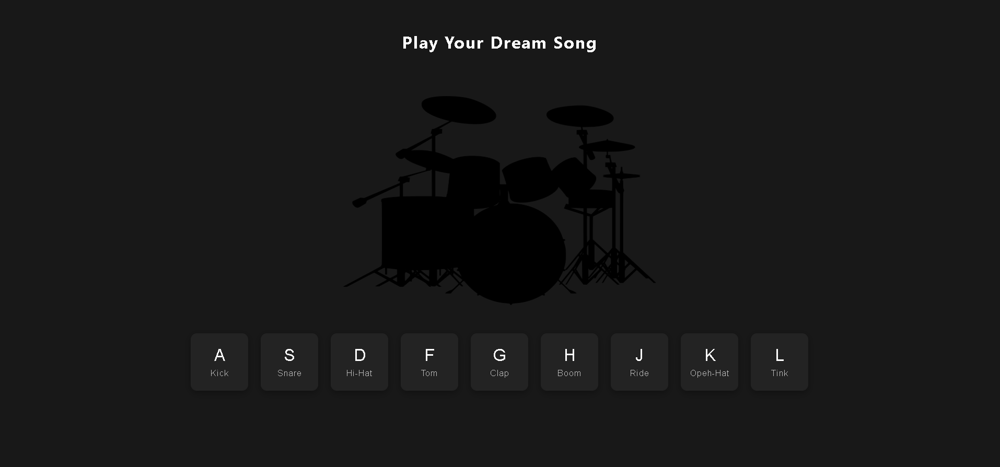

# Drum Kit

Canlı Demo:  
[Drum Kit]()

## Açıklama
Bu projede HTML, CSS ve JavaScript kullanılarak interaktif bir Drum Kit uygulaması geliştirilmiştir. Klavyeden veya ekrandaki butonlara tıklayarak davul sesleri çıkarabilirsiniz.

## Özellikler
- Klavye ve fare ile davul çalma
- Farklı tuşlarda farklı animasyon efektleri
